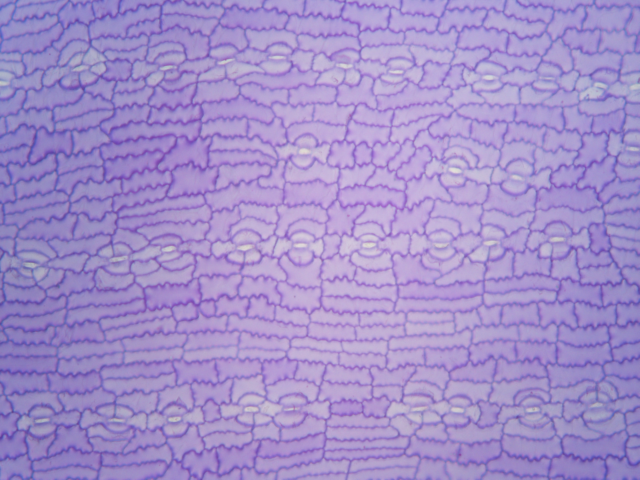
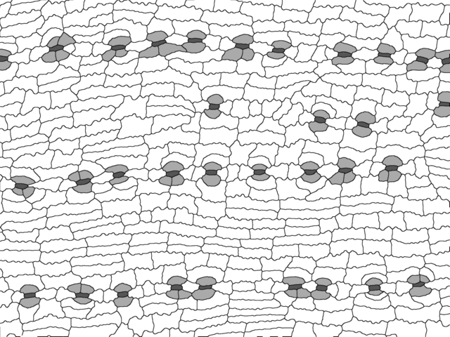
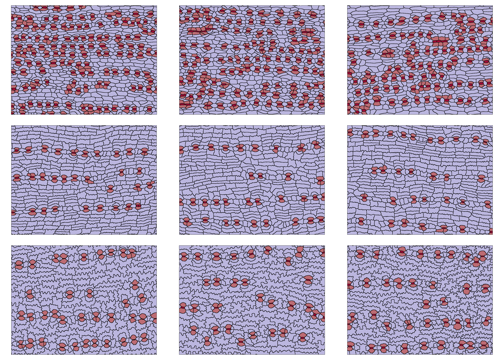

```{r, include = FALSE}
knitr::opts_chunk$set(
  collapse = TRUE,
  comment = "#>"
)
knitr::opts_knit$set(global.par = TRUE)
```

```{r setup, message=FALSE}
library(dplyr)
library(epidermalmorph)
library(ggplot2)
library(imager)
library(randomcoloR)
library(reshape2)
library(sf)
library(tidyr)
```


## Input for `epidermalmorph`
Here is an example of an unprocessed (raw) image of a cuticle preparation cuticle of *Podocarpus*, taken using a microscope:

<center>
{width=60%}
</center>

For analysis with `epidermalmorph`, images need to be segmented (or traced). This can be done manually (e.g. using the paint tool from ImageJ, MS Paint) or with some degree of automation, but requires cell wall pixels to be black (value of 0) and **no anti-aliasing** to be applied (i.e., the edges of the pixels should be crisp). Other cell types can be labelled by using different values (colours). Here is what that might look like: 

<center>
{width=60%}
</center>

Our cell walls are black (value of 0), stomata are dark grey (85), subsidiary 
cells are light grey (170) and pavement cells are white (255).  

## Extracting cell measurements
### The `image_to_poly()` function
Before we can measure cells, they need to be transformed from pixels to polygons:
```{r eval=FALSE}
polys1.1 <- image_to_poly(dir='images', file="traced_im.png")
```
```{r echo=FALSE}
load("polys1-1.RData")
```

This gives us a list, with an object called `cells` (our polygons) and an object called `junction_points` (used for cell quantification). 
We can confirm that this has worked by plotting our polygons with a unique colour for each cell:
```{r eval=FALSE}
#generate as many random colours as there are cells

n <- nrow(polys1.1$cells)
palette <- distinctColorPalette(n)

ggplot()+
  geom_sf(data=polys1.1$cells, col="black", fill=palette)+
  theme_void()

```

```{r, echo=FALSE, fig.dim = c(7,6)}

load("p1.Rdata")
print(p1)

```
We can also check that the cell types (as values) have been preserved during the conversion from pixels to polygons: 
```{r eval=FALSE}
#simplify palette to cell types
palette <- c("#A30B37", "#bd6b73", "#bbb6df")

ggplot()+
  geom_sf(data=polys1.1$cells, col="black", fill=palette[factor(polys1.1$cells$value)])+
  theme_void()

```
```{r echo=FALSE,  fig.dim = c(7,6)}
load("p2.Rdata")
print(p2)
```

### Trait extraction

The stomatal complexes are in red (lighter red shows the subsidiary cells). 
Now we can extract the measurements from it:
```{r eval=FALSE}

traits1.1 <- extract_epidermal_traits(image.ID = "Image1.1", 
                                      cell.polygons=polys1.1$cells, 
                                      junction.points=polys1.1$junction_coords, 
                                      cells.present = c("pavement", "stomata","subsidiary"), 
                                      wall.width = 3, 
                                      cell.values=c(255,85, 170), 
                                      sd.measures = FALSE, #no variability traits
                                      image.scale = NULL,  verbose=TRUE) 
#this can take up to around 10 minutes per image

```


```{r echo=FALSE}
load("traits1.1.RData")
```
`extract_epidermal_traits` returns a list:

* `image_data` the measured traits, summarised to give one value per image
* `pavezone_individual_data` measurements for individual pavement zone cells (not adjacent to a stomatal complex)
* `stomzone_individual_data` measurements for individual stomatal zone cells (adjacent to a stomatal complex)
* `polar_individual_data` measurements for individual polar subsidiary cells (those that share a cell wall with the guard cells/stomatal pore, regardless of whether or not they are considered 'true' subsidiary cells)
* `stomata_individual_data` measurements for individual stomatal complex
* `polygons` the `sf` polygons of the cells (removed here to reduce vignette size)
```{r}
dplyr::glimpse(traits1.1$image_data)
```
For a full description of all traits, we can refer to `trait_key`:
```{r}
head(trait_key)
```


## Which traits can we reliably quantify for a particular group of plants? 
In this vignette, we will use nine pre-traced images (three images per plant, from three plants in the Podocarpaceae) to demonstrate a possible workflow for `epidermalmorph`. These cells are from *Acmopyle pancheri* (top row), *Podocarpus dispermus* (middle row) and *Sundacarpus amarus* (labeled as *Prumnopitys amara*; bottom row). Note that for a family-level study, three plants would not be sufficient to accurately assess prediction (*see* Brown, 2022)

The epidermal cells of these three plants are clearly distinguishable from each other: 

```{r eval=FALSE}
load("polys.Rdata")

p <- list()
palette <- c("#A30B37", "#bd6b73", "#bbb6df")

for (i in 1:9){

  p[[i]] <- ggplot()+
          geom_sf(data=polys[[i]]$cells, col="black", fill=palette[factor(polys[[i]]$cells$value)])+
          theme_void()
}

cowplot::plot_grid(plotlist=p, nrow=3)
```
{width=100%}

Now we can extract the traits. There is no parallel implementation in `epidermalmorph`, but we suggest extracting traits from multiple images in parallel, like so: 

```{r eval=FALSE}
library(parallel)
library(doParallel)
library(foreach)

#names for ID column - the file names of the images
names <- c("Acmopyle_pancheri_1.tif",
           "Acmopyle_pancheri_2.tif",
           "Acmopyle_pancheri_1_3.tif",
           "Podocarpus_dispermus_1.tif",
           "Podocarpus_dispermus_2.tif",
           "Podocarpus_dispermus_3.tif",
           "Sundacarpus_amarus_1.tif",
           "Sundacarpus_amarus_2.tif",
           "Sundacarpus_amarus_3.tif")

cl = makeCluster(3)
registerDoParallel(cl)


df_all <- foreach(i=1:9, .packages = "epidermalmorph") %dopar% {
extract_epidermal_traits(image.ID = names[i], 
                         cell.polygons = polys[[i]][[1]], 
                         junction.points = polys[[i]][[2]],
                         cells.present = c("pavement", "stomata", 
                                           "subsidiary"), 
                         sd.measures = FALSE, #no variability traits
                         cell.values=c(255,85,170))
}


stopCluster(cl)
```


```{r echo=FALSE}
load("df_all.RData")
```


For now, we just want to compare the overall measurements, so we'll bind the first element of each list together, and scale our trait measurements so that they can be be compared (we're saving the global standard deviations to be used later): 
```{r}
df_im <- do.call(rbind,lapply(df_all,"[[",1))


globalSDs <- attr(scale(df_im[,10:39]),"scaled:scale") #used later in this vignette

df_im <- df_im %>% 
  mutate(across(stomatal.density:polar.undulation.freq.mean,   ~as.numeric(scale(.))))

glimpse(df_im[,1:10]) #only show first 10 columns for brevity
```

This data is only identified by the image filename - we need to add the image metadata (here, with species and individual information)
```{r}
df_meta <- read.csv("example_metadata.csv", fileEncoding = 'UTF-8-BOM')

glimpse(df_meta)

df_im <- left_join(df_meta, df_im) 
```


Now we can look at how much intra-individual variation there is in each of our measured traits. 

One way we can visualise this is by plotting each measurement for each individual, where larger ranges (wider bars) indicate less intra-individual variation:  
```{r fig.dim = c(7, 8)}
df_im_long <- df_im %>% 
  pivot_longer(10:43)

ggplot(df_im_long)+
  geom_point(aes(x=name, y=value, group=individual, col=individual))+
  geom_line(aes(x=name, y=value, group=name, col=individual))+
  theme(axis.text.x = element_blank(),
        axis.text.y = element_blank())+
  facet_wrap(vars(individual))+
  coord_flip()+
  ggpubr::theme_pubclean()+
  theme(legend.position = "bottom",legend.direction="vertical")
```
This is an intuitive way to look at trait reliability, but gets out of hand quickly when considering a larger set of individuals/species. 

`epidermalmorph` includes the `epidermal_trait_reliability` function, which produces a list of two objects: 

* a data.frame with the reliability estimates
* a ggplot heatmap visualisation of this information, where the colour of the tile represents the width of the corresponding line in the above plot

```{r}
df_reliability <- epidermal_trait_reliability(df_im, 
                                              grouping.variable="individual", 
                                              heatmap = TRUE)
```

```{r fig.dim = c(6, 8)}
df_reliability[[2]]
```

From this, it is easier to see that *Podocarpus dispermus* tends to be more consistent across images, and if we define a reliable trait as one that has a within-individual variation of no more than 25% of the total variation (i.e. `thresholdval = 0.25`), we can identify four traits that can be reliably measured from an image of each of these plants: `r paste(levels(df_reliability[[1]]$trait)[30:33], sep=", ")`

Note that for this set of podocarps, stomatal index is one of the most reliable traits that can be measured from an image - this is not the case when analysing a wider set of plants (Brown, 2022), highlighting the need to calibrate these measurements carefully to the study system and select a **representative subset** of this group to evaluate reliability.  

We can extract these traits automatically using the data.frame that is returned by `epidermal_trait_reliability()` - here is one example of how that could be done:

```{r}
reliable_traits <- df_reliability[[1]] %>% 
                group_by(trait) %>% 
                summarise(maxvar=max(variation)) %>% 
                filter(maxvar<0.25) %>% 
                pull(trait) %>% 
                as.character()
reliable_traits
```


## How many cells do I need to trace? 
The limiting step in the `epidermalmorph` workflow is undoubtedly the segmentation, or tracing of images, so it is useful to know how many cells we need to measure to get a good estimate of the traits for that individual or species. 

`epidermalmorph` provides a function to do this. By repeatedly subsampling patches of cells (i.e. simulating tracing only a portion of an image) then plotting how much the measured traits differ from the groundtruth (the trait value measured from all cells in an image). For more details, see Brown (2022). 

This should be done for the same imageset that is used to evaluate trait reliability, but for demonstration purposes, here we will only use Image1.1 (from above). 

Here, we repeat trait measurements using small patches of cells from the image. As noted above, we do not include parallel execution in the package but suggest that this step could be run in parallel for multiple images:

```{r eval=FALSE}
df <- subsample_epidermal_traits(traits1.1, n.runs = 100, 
                                 k.cells = c(15,50,100,150,200,250,300,350,400), 
                                 scaling =globalSDs,
                                 trait.subset = reliable_traits)

```
```{r echo=FALSE}
load("df.RData")
```

If we were analysing multiple images, we would then bind the rows for each image into one data.frame (we have kept these two functions separate to facilitate parallel execution). 

Then, we can evaluate how each trait measurement varies over different sample sizes by plotting the standard deviation of sampled measurements against the number of relevant cells (see Brown, 2022 for details). 

Points in the grey represent trait-sample combinations that are above the user-defined threshold (here, 20% of the global variation)
```{r fig.dim=c(6,14)}
p <- subsampling_summary(df, traits=reliable_traits, thresholdvalue = 0.2, number.of.bins = 8)
cowplot::plot_grid(plotlist=p[[1]], ncol=1,align = "v")
```

From these plots, we can see that, *for this image*: 

* 100 cells in total is sufficient for pavement cell traits to be measured
* 50 pavement cells in total is sufficient for pavement cell traits (from all zones)
* 30 stomata (or more) are required to measure stomatal index
* For specific types of pavement cells (pavezone, stomzone), 20-40 cells are sufficient. 


We recommend that analyses of trait reliability and sampling effort be done for any study that employs `epidermalmorph` to provide evidence that trait measurements and cell sample sizes are sufficient to reliably measure traits. 


## References
Brown, M.J.M. (2022). *Old plants, new tricks: machine learning and the conifer fossil record*. (Doctoral dissertation, University of Tasmania).


