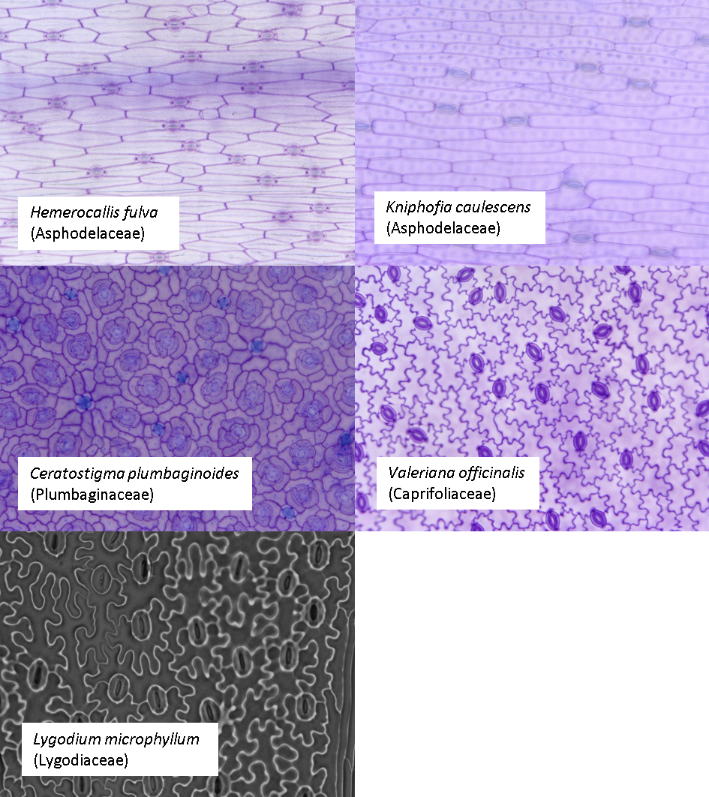
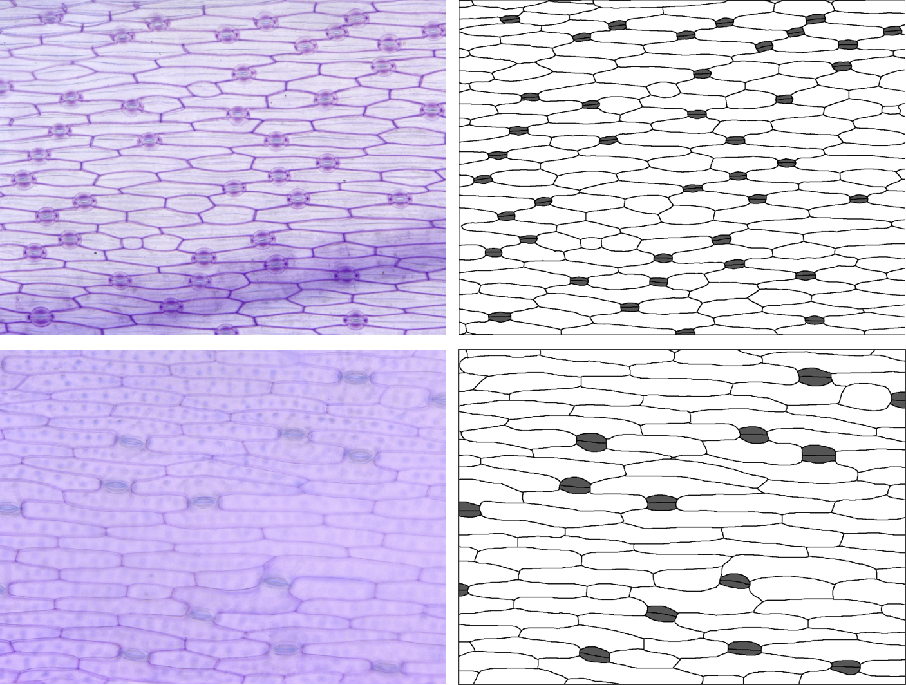
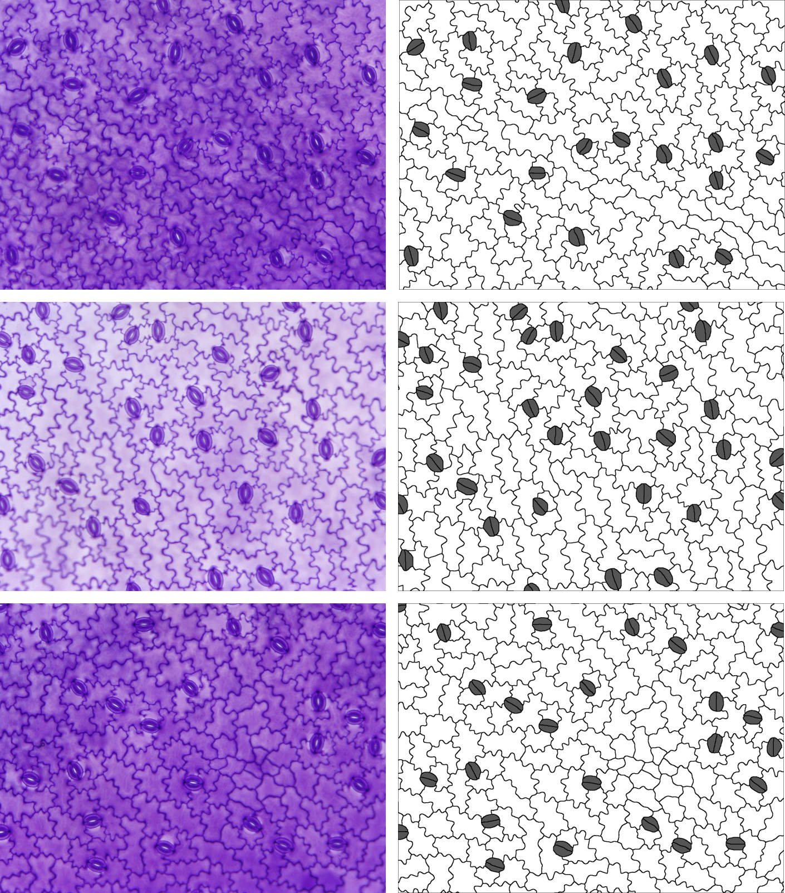
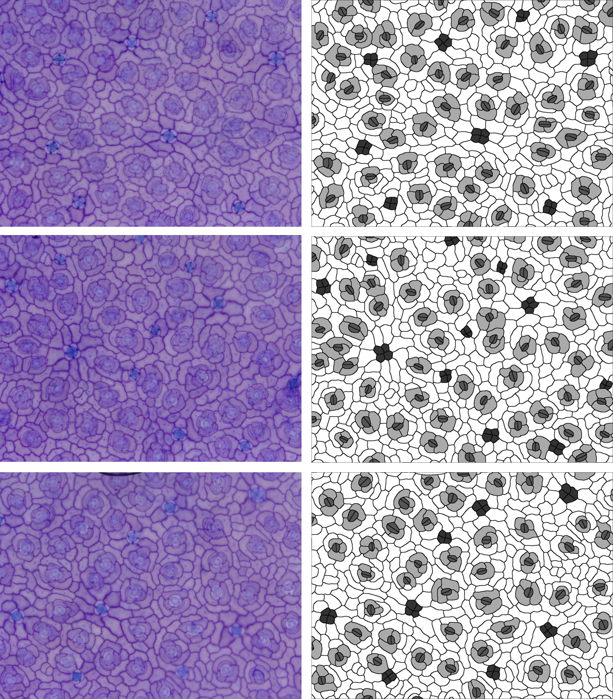
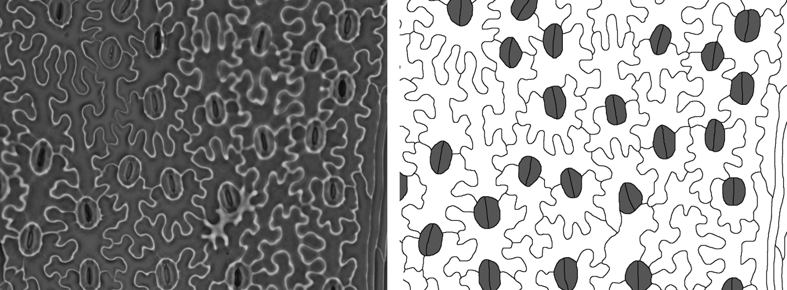

```{r message=FALSE}
library(epidermalmorph)
library(dplyr)
library(ggplot2)
library(factoextra)
```

In 'Introduction to epidermalmorph', we looked at a workflow for one group of plants, with a specific type of stomatal morphology: subsidiary cells arranged on either side of the guard cells, with stomata aligned in rows and traced as single cells (both guard cells and the pore forming the same polygon). However, `epidermalmorph` can be used to extract epidermal traits from a wide range of different plants - this is what we will do here. 


Let's start by looking at our example images; we are going to look at 5 species of plant with 1-3 images per species; these images are all available in the Supporting Information of: Vőfély, R. V., Gallagher, J., Pisano, G. D., Bartlett, M., & Braybrook, S. A. (2019). *Of puzzles and pavements: a quantitative exploration of leaf epidermal cell shape*. New Phytologist, **221**(1), 540-552.



Some of these species have subsidiary cells, some have randomly aligned stomata and one (Ceratostigma) has salt glands, clustered in groups of four. What does this mean for using `epidermalmorph`? 

Let's go through species by species, but first we'll set up somewhere for our extracted trait data to live: 
```{r}
traits <- list()
dir <- "images"
```


### *Kniphofia caulescens* and *Hemerocallis fulva*

In these two species, there are no subsidiary cells, so `stom.symmetry.mean` and `stom.butterfly.mean` don't make any sense - we'll exclude them using the `specific.exclusions` argument. 
Guard cells have been traced as pairs (two cells rather than one), so we'll set `paired.guard.cells` to `TRUE`. 

Note: this document suppresses the messages generated by `extract_epidermal_traits`, but an example is shown for *Ceratostigma* below. 


 
```{r eval=FALSE}
files <- c("Kniphofia_1.tif","Kniphofia_2.tif","Kniphofia_3.tif",
           "Hemerocallis_1.tif","Hemerocallis_2.tif","Hemerocallis_3.tif")
for (i in 1:length(files)){
p <- image_to_poly(dir, files[i])
id <- substr(files[i], 1, nchar(files[i])-4) #drop the .tif for the image ID

#append these results to the growing list of results
traits[[length(traits)+1]] <- extract_epidermal_traits(
  image.ID = id,
  cell.polygons = p$cells,
  junction.points = p$junction_coords,
  cells.present = c("pavement","stomata"),
  cell.values = c(255,85),
  paired.guard.cells = TRUE,
  sd.measures = FALSE, #just to reduce the number of traits
  specific.exclusions = c("symmetry", "butterfly")
)
}

```

### *Valeriana officinalis*

In this species, there are no subsidiary cells, so `stom.symmetry.mean` and `stom.butterfly.mean` don't make any sense - we'll exclude them using the `specific.exclusions` argument. 
The stomata are randomly oriented, so we'll set `stomatal.north` to 0. They are also in pairs (two cells rather than one), so we'll set `paired.guard.cells` to `TRUE`. 


 
```{r eval=FALSE}
files <- c("Valeriana_1.tif","Valeriana_2.tif","Valeriana_3.tif")

for (i in 1:length(files)){
  
p <- image_to_poly(dir,files[i])
id <- substr(files[i], 1, nchar(files[i])-4) #drop the .tif for the image ID

traits[[length(traits)+1]] <- extract_epidermal_traits(
  image.ID = id,
  cell.polygons = p$cells,
  junction.points = p$junction_coords,
  cells.present = c("pavement","stomata"),
  cell.values = c(255,85),
  paired.guard.cells = TRUE,
  stomatal.north = 0,
  sd.measures = FALSE, #to reduce the number of traits
  specific.exclusions = c("symmetry","butterfly","endwall"))
}
```
### *Ceratostigma plumbaginoides*

In this species, there are subsidiary cells, but they form an encircling ring, so `stom.symmetry.mean` and `stom.butterfly.mean` don't make any sense here either - we'll exclude them again using the `specific.exclusions` argument. 

 

Again, the stomata are randomly oriented, so we'll set `stomatal.north` to 0. They are also in pairs (two cells rather than one), so we'll keep `paired.guard.cells` set to `TRUE`. 
There is also another type of cell - the salt glands. First, let's see what happens when we ignore it:
 
```{r eval=FALSE}
files <- c("Ceratostigma_1.tif","Ceratostigma_2.tif","Ceratostigma_3.tif")

#just the first one as a test
  
p <- image_to_poly(dir,files[1])
id <- substr(files[1], 1, nchar(files[1])-4) #drop the .tif for the image ID

extract_epidermal_traits(
  image.ID = id,
  cell.polygons = p$cells,
  junction.points = p$junction_coords,
  cells.present = c("pavement","stomata","subsidiary"),
  cell.values = c(255,85,170),
  paired.guard.cells = TRUE,
  stomatal.north = 0,   
  sd.measures = FALSE, # to reduce the number of traits
  specific.exclusions = c("symmetry","butterfly")
  ) %>% str()
```


The salt glands still get measured (as `othertype1`), but it would be nice to specify a name, so here we've added them to the `cells.present` and `cell.values` arguments. We also get a warning about endwall angles not being reliable, so we'll exclude anything to do with endwalls using the `specific.exclsions` argument - we can use a keyword rather than the full trait names. 
```{r eval=FALSE}

for (i in 1:length(files)){
  
p <- image_to_poly(dir,files[i])
id <- substr(files[i], 1, nchar(files[i])-4) #drop the .tif for the image ID

traits[[length(traits)+1]] <- extract_epidermal_traits(
  image.ID = id,
  cell.polygons = p$cells,
  junction.points = p$junction_coords,
  cells.present = c("pavement","stomata","subsidiary","saltgland"),
  cell.values = c(255,85,170,50),
  paired.guard.cells = TRUE,
  stomatal.north = 0,   
  sd.measures = FALSE, #just to reduce the number of traits
  specific.exclusions = c("symmetry","butterfly","endwall"))
}
```

## *Lygodium microphyllum*

One last example, because in this one the image has been taken with the stomata aligned vertically, so we need to set `image.alignment` to "vertical" (the default is "horizontal", but we can also set "none"). The raw image is also quite different to the others, but the tracing follows the same principles. 


```{r eval=FALSE}
files <- c("Lygodium_1.tif")

p <- image_to_poly(dir, files)
id <- substr(files, 1, nchar(files)-4) #drop the .tif for the image ID

traits[[length(traits)+1]] <- extract_epidermal_traits(
  image.ID = id,
  cell.polygons = p$cells,
  junction.points = p$junction_coords,
  cells.present = c("pavement","stomata"),
  cell.values = c(255,85),
  paired.guard.cells = TRUE,
  image.alignment = "vertical" ,
  sd.measures = FALSE, #just to reduce the number of traits
  specific.exclusions = c("symmetry","butterfly"))
```
```{r echo=FALSE}
load("traits.RData")
```


Now we can compare these species, but there are two things we have to be careful of. 
1. Not all species have all traits measured
2. The scale for these images is not consistent - we could have passed the scales individually using `image.scale` but several of the extracted traits are ratios and this scale-independent, so we can actually still compare them even if we do not know the scale of each image. These scale-independent traits include: index traits (e.g. stomatal index), complexity traits (e.g. pavezone cell complexity), aspect ratio and traits (e.g. stomatal complex aspect ratio), number of junction points,  endwall angles, stomatal symmetry, and the stomatal butterfly metric (ratio of guard cell to lateral subsidiary cell lengths). 

Let's bind all our extracted traits into a dataset and select only those traits that are scale-independent AND were measured for all images:
```{r}
traits_all <- traits[[1]]$image_data
for (i in 2:13){
  traits_all <- bind_rows(traits_all, traits[[i]]$image_data)
}


#select only the scale-independent traits (ratios) using the trait key 
scale_independent_traits <- trait_key$trait[which(trait_key$scaledependent==0)]
traits_scaleind <- traits_all[,which(colnames(traits_all) %in% scale_independent_traits)]

traits_nona <- traits_scaleind[ , colSums(is.na(traits_scaleind)) == 0]


#add genus using the underscore as a way of splitting the IDs
traits_nona$genus <- sapply(strsplit(traits_nona$image.ID, "_"),"[[",1)

#plot two of these
ggplot(traits_nona, aes(x=pavezone.complexity.median,
                       y=stom.AR.mean,
                       colour=genus)) +
  geom_point(size=3) +
  theme_classic()


```
    
We might then do a PCA or an LDA to reduce the dimensionality and visualise our trait-space - this is where this example finishes.

```{r}
traits_pca <- prcomp(traits_nona[,3:14], scale. = TRUE)
summary(traits_pca)

#basic visualisation
fviz_pca_ind(traits_pca, habillage=traits_nona$genus)
fviz_pca_var(traits_pca)
```

